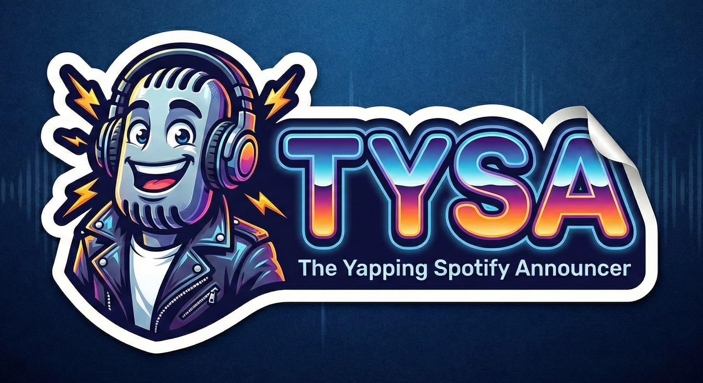

# 🎤 TYSA: The Yapping Spotify Announcer



TYSA is your digital radio DJ. A Python script that detects your current Spotify track and announces it with smooth, AI-generated commentary. It's like having a late-night FM host living in your terminal.

Yes, I know this completely outs me as someone who listens to classical music. And yes, that's exactly why GPT simplification exists - because nobody wants to hear "Symphony No. 9 in D Minor, Op. 125 'Choral': IV. Presto - Allegro assai" when you can just say "Ode to Joy." 🎻

(Note: This is for macOS with Spotify Desktop only (4now))

## 🎙️ The Origin Story

Spotify Wrapped told me I'm in the top 1% of listeners with 100,000 minutes streamed. Impressive, right? Plot twist: play me my top song and I can barely tell you the name or artist. Turns out you can listen to thousands of hours of music and learn absolutely nothing if you're not paying attention.

So I figured, what if I learned unconsciously? If someone announced the song and artist every single time a track played, maybe, just maybe - the information would eventually stick. TYSA is that someone. Now my terminal is a radio DJ that won't shut up, and honestly, it's working.

## Features

- GPT-4o-mini simplifies complex classical titles and detects song language
- Multilingual support with automatic language detection
- ElevenLabs TTS for natural voice announcements (v3 or flash_v2_5)
- Localized broadcasts: seamlessly switch between languages mid-announcement
- Caches everything - replays cost $0

## Cost Estimate

**Characters per song:**
- Basic/Smart: ~45 chars (no brackets)
- Wizard: ~90 chars (with language switching brackets)

**ElevenLabs free tier (monthly):**
- Flash (basic/smart): 20,000 chars = **~444 unique songs**
- v3 (wizard): 10,000 chars = **~110 unique songs**

**Paid tier ($5/month):**
- Flash: 60,000 chars = 1,333 songs
- v3: 30,000 chars = 333 songs
  
**Replays: $0** - Everything is cached!

### How Long Can I Listen?

**10 hours/day = ~171 songs** (assuming 3.5 min/song)

## Setup

```bash
git clone <your-repo-url>
cd tysa
cp .env.example .env
```

Add your API keys to `.env`:
- ElevenLabs: https://elevenlabs.io/ (required)
- OpenAI: https://platform.openai.com/api-keys (only for smart/wizard mode)

Run it:
```bash
./run.sh
```

Stop with `Ctrl+C` or `pkill -f tysa.py` or use your own terminal multiplexer

## Configuration

| Variable | Default | What It Does |
|----------|---------|--------------|
| `ELEVENLABS_API_KEY` | *required* | Your ElevenLabs API key |
| `ELEVENLABS_VOICE_ID` | `RexqLjNzkCjWogguKyff` | Voice ID (default: Bradley). Pick a multilingual voice! |
| `OPENAI_API_KEY` | *smart/wizard only* | Your OpenAI API key (not needed for basic mode) |
| `OPENAI_MODEL` | `gpt-4o-mini` | Model for title simplification |
| `MODE` | `smart` | Announcement mode: `basic`, `smart`, or `wizard` |
| `LANGUAGE_CODE` | `en` | Base language (en, sv, de, fr, etc.). Match to your voice! |
| `NOW_PLAYING_TEXT` | `Now playing` | Custom "Now playing" text (basic mode only) |
| `BY_TEXT` | `by` | Custom "by" text (basic mode only) |
| `PLAYBACK_VOLUME` | `0.5` | Volume (0.0=silent, 1.0=max) |
| `POLL_INTERVAL_SECONDS` | `1` | How often to check for track changes |
| `DEBUG` | `false` | Log to terminal (true) or file only (false) |
| `OUTPUT_DIR` | `output` | Where to save generated MP3s |
| `RUN_MODE` | `continuous` | `continuous` or `once` |

### Modes 🎚️

**Basic Mode** (`MODE=basic`):
- No GPT, no OpenAI API key needed
- Fastest & cheapest
- User provides announcement strings
- Example: Set `NOW_PLAYING_TEXT=Nu spelas` and `BY_TEXT=av` → "Nu spelas: Bohemian Rhapsody - av - Queen"

**Smart Mode** (`MODE=smart`):
- GPT translates & simplifies titles
- Uses `eleven_flash_v2_5`
- Entire announcement in base language
- Example (LANGUAGE_CODE=sv): "Nu spelas: Bohemian Rhapsody - av - Queen"

**Wizard Mode** 🧙‍♂️ (`MODE=wizard`):
- GPT + multilingual inline switching
- Uses `eleven_v3` with brackets
- Songs pronounced in native language
- Example (LANGUAGE_CODE=sv): "Nu spelas: [read in en]Gaia [read in sv] - av - [read in en]Oliver Ólafsson"

## How It Works

1. AppleScript polls Spotify for track changes
2. Announcement generated based on mode:
   - **Basic**: Direct string substitution (Cheapest and fastest)
   - **Smart**: GPT simplifies & translates (For my classical friends)
   - **Wizard**: GPT + multilingual formatting (Reads songs and artists in their native language)
3. ElevenLabs converts to speech (flash_v2_5 or v3)
4. Audio plays via `afplay`
5. Everything caches for instant replays

Generated files go to `output/` like `Beethoven_Moonlight_Sonata.mp3`

## Troubleshooting

**"Nothing is currently playing"** - Spotify must be running and playing

**"Missing required environment variables"** - Check `.env` has `ELEVENLABS_API_KEY` (and `OPENAI_API_KEY` if using smart/wizard mode)

**Permission errors** - System Preferences → Privacy & Security → Automation, grant terminal access to Spotify

**Volume issues** - Adjust `PLAYBACK_VOLUME` in `.env` (0.0 to 1.0)

## Advanced

Run once:
```bash
RUN_MODE=once ./run.sh
```

Manual Python:
```bash
python3 -m venv venv
source venv/bin/activate
pip install -r requirements.txt
python tysa.py
```

## Requirements

macOS, Python 3.8+, Spotify Desktop, ElevenLabs API key, OpenAI API key (smart/wizard mode only)

## License

MIT
